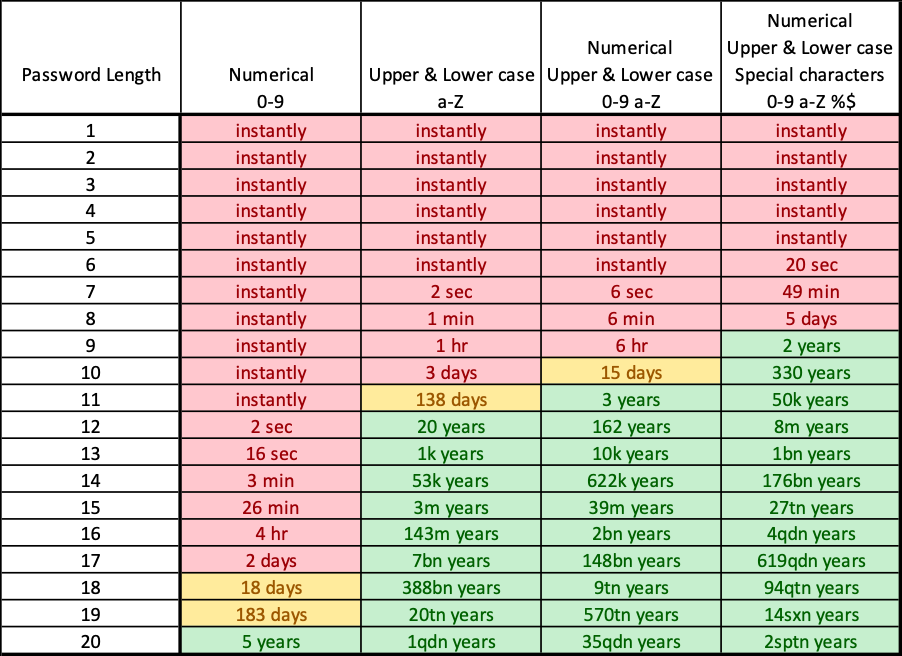

# Дипломная работа
## Организация логинов и паролей, пользователей информационной системы "my_blog"
WSGI-приложение  
(Web Server Gateway Interface - стандарт взаимодействия между python-программой,
выполняющейся на стороне сервера, и самим веб-сервером) 

### План
#### Начальный план:
1) Создание учетной записи:проверка сложности пароля, генератор надежного пароля.
2) Авторизация через сторонние системы, с помощью вконтакте, яндекса, гугла, гитхаб, сбер.
3) Хэширование паролей в БД
4) Защита от SQL-инъекций
5) Проверка паролей на утечки.(сайт have i been pwned)
6) Проверка пароля на фишинг
7) Регулярная смена пароля. Предупреждение пользователя, блокировка УЗ, если пароль не был сменен во время

#### Текущий план:
Далее план будет расширяться, будет добавлен для каждого пункта процент готовности
* Создаём приложение my_blog
   * окна пользователя
     * ввод пароля - 80%       
       * войти через google (80% что будет) - 20%
       * войти через GitHub (50% что будет) - 5%
       * войти через VK (под вопросом) - 0%
       * ввод email - 100%
       * ввод пароля - 100%
       * переход в регистрацию - 100%
       * переход в Сброс пароля, через почту - 100%        
     * регистрация - 40%
       * регистрация через google (80% что будет) - 20%
       * регистрация через GitHub (50% что будет) - 5%
       * регистрация через VK (под вопросом) - 0%
       * проверка email - 80%
         * проверка на правильность формата - 100%
         * проверка на дубль (т.е. не должна уже быть в базе) - 100%
         * проверка на утечку через API [Have I Been Pwned API v3](https://haveibeenpwned.com/API/v3#BreachesForAccount) - 1% 
       * проверка пароля - 40% 
         * проверка на длину (например от 2х до ...) символов - 100%
         * проверка наличия типов символов (большая, маленькая, цифры, спец-символы) - 100%
         * проверка на идущие рядом символы (под вопросом) - 0%
         * проверка на утечку - 1%
           * через API (95% что будет) - 2%
           * через скачанный файл с хешами паролей (5% что будет) - 1%
         * проверка на SLQ-инъекции - 0% (не будет, только написать, что при использовании моделей инъекции сделать не получиться)
         * повторный ввод пароля, должен равен первому - 100%
         * генератор пароля (под вопросом) - 0% 
         * отображение сложности пароля (под вопросом) - 0%
       * выбор аватарки, если не выбрать будет отображаться default.png - 90% 
         * выбор аватарки из предложенной коллекции - (под вопросом) - 0%
       * дополнительные поля - 0%
     * профиль пользователя - 50%
       * смена email (проверки см. регистрация) - 80% 
       * смена аватарки - 90%
         * выбор аватарки из предложенной коллекции - (под вопросом) - 0% 
       * переход на ввод нового пароля - 0%
       * дополнительные поля - 0%
     * Сброс пароля, через почту - 80%
       * проверка email - 100%
         * проверка на правильность формата - 100% 
         * проверка на наличия пользователя с данным email в базе - 100%
     * ввод нового пароля - 10%
       * проверка пароля - 10%
         * см. проверку при регистрации - 10%
         * проверка, что бы был не равен старому паролю - 0%
         * проверка, что бы был не равен списку старых паролей (под вопросом) - 0%
   * окна постов - 80%
      * все посты - 100%
      * посты только выбранного пользователя - 100%
      * один пост - 80%
        * если пост владельца, то возможность удалять, править - 100%
        * если пользователь админа, то возможность удалять, править (под вопросом) - 0%
      * создание поста - 100%
   * комментарии к постам (под вопросом) - 5%
   * лайки постам (под вопросом) - 5%
   * админка - 10%
     * тут ещё много вопросов - 10%
     * массовая проверка на утечки email - 0%
     * массовая проверка на утечки паролей - 0%
* фишинговый сайт (5% что будет) - 0%
  * не понятно куда складывать ворованные почту и пароли

#### Дополнительные задачи:
* прикрутить Flask-Bootstrap для стилей избавиться от старых стилей - 0%
* разобраться с админкой (там пока всё плохо) - 10%
* по возможности поправить код, а то его много просто скопированного с курса (мало ли запалят) - 50%

### Структура файлов проекта
* migrations - каталог миграции базы
* my_blog - проект блога
  * data - данные
    * app.db - файл с sqlite базой блога
  * errors - макеты ошибок (blueprint)
    * handlers.py - маршруты-обработчики ошибок
  * main - макет по умолчанию (blueprint)
    * routes.py - маршруты
  * posts - макеты постов (blueprint)
    * forms - формы
    * routes.py - маршруты
  * static - статические файлы
    * avatars - аватарки пользователей
    * css - шаблоны стилей
    * images - картинки
  * templates - шаблоны страниц HTML
    * errors - шаблоны ошибок
    * reset_request.html - отправка запроса на почту на сброс пароля
    * reset_token.html - ввод нового пароля через ссылку из почты
    * users - макеты пользователей (blueprint)
      * forms - формы
      * routes.py - маршруты
      * utils.py - утилиты для работы с пользователями
      * validators - дополнительные классы валидации полей Users
    * __init__.py - инициализация проекта блога (там вся инициализация)
    * configs.py - конфигурационный файл
    * models.py - модели (пользователи, посты)
* runner.py - запуск проекта
* Procfile - файл для развёртывания приложений в облачных хостиногов, таких, как Heroku...
* requirements.txt - список используемых библиотек, используется для их развертывания
* runtime - указания версии python

### Используемый стек
* python 3.12
* Flask - микро-фреймворк для веб-разработки (`pip install Flask`)
  * Jinja2 - шаблонизатор
  * WTForms (Flask-WTF) - генератор WT-форм для Flask (`pip install -U Flask-SQLAlchemy`)
  * Flask-SQLAlchemy - работа с Базами Данных (`pip install -U Flask-SQLAlchemy`)
  * Flask-Mail - работа с почтой, основан на smtplib (`pip install Flask-Mail`)
  * Flask-Login - аутентификация (`pip install flask-login`)
  * Flask-Bcrypt - функционал для хеширования и проверки паролей (`pip install flask-bcrypt`)
  * Flask-Bootstrap - CSS фреймворк (`pip install flask-bootstrap`)
  * Flask-Dance - авторизация через OAuth (`pip install flask-dance google-auth-oauthlib`)
  * Flask-Gunicorn - WSGI-сервер для Python-Flask веб-приложений (`pip install gunicorn`)
  * Flask-Admin - административный интерфейс (`pip install Flask-Admin`)
  * Flask-Security - роли пользователей (`pip install flask-security`)
  * Flask-Migrate - обновление полей базы данных (`pip install flask-migrate`)
* SQLite - база данных, основанная на файле. Включен в Flask-SQLAlchemy.
* Pillow - работа с изображениями (`pip install Pillow`)
* ItsDangerous - обеспечение безопасности передачи данных (`pip install itsdangerous`)

### Источники
#### Статьи
[Проектирование простых приложений в Flask (хабр)](https://habr.com/ru/articles/275099/)  
[Мега-Учебник Flask (хабр)](https://habr.com/ru/articles/193242/)  
[Flask. Наполняем «флягу» функционалом (хабр)](https://habr.com/ru/articles/251415/)  
[Начинающему веб-мастеру: делаем одностраничник на Bootstrap (хабр)](https://habr.com/ru/companies/ruvds/articles/350758/)  
[Flask-Admin (хабр)](https://habr.com/ru/articles/148765/)  

#### Документация используемых библиотек
[Flask](https://flask.palletsprojects.com/en/stable/)  
[Jinja2](https://jinja.palletsprojects.com/en/stable/)  
[Flask WTF](https://flask-wtf.readthedocs.io/en/1.2.x/)  
[Flask-SQLAlchemy](https://flask-sqlalchemy.readthedocs.io/en/stable/)  
[Flask-Mail](https://flask-mail.readthedocs.io/en/latest/)  
[Flask-Login](https://flask-login.readthedocs.io/en/latest/)  
[Flask-Bootstrap](https://getbootstrap.com/docs/3.3/getting-started/)  
[Flask-Dance](https://flask-dance.readthedocs.io/en/latest/#)  
[Flask-Gunicorn](https://flask.palletsprojects.com/en/stable/deploying/gunicorn/)  
[Flask-Admin](https://flask-admin.readthedocs.io/en/stable/)  
[Pillow](https://pillow.readthedocs.io/en/stable/)  
[ItsDangerous](https://itsdangerous.palletsprojects.com/en/stable/)  

#### Полезные ссылки
[Дизайнер SQL таблиц](https://sql.toad.cz/?)  
[DB Browser for SQLite - программа просмотра базы SQLite](https://sqlitebrowser.org/dl/)  
[Иконки для кнопок](https://fontawesome.com/v4/icons/)  

### Разное
Загрузить библиотеки в requirements.txt (из каталога проекта):  
`pip freeze > requirements.txt`  
Инсталлировать все библиотеки из requirements.txt:  
`pip install -r requirements.txt`  

### Схема данных  
#### users - таблица пользователей  
id - INTEGER, PK, NOT NULL - идентификатор пользователя  
username - VARCHAR(20) NOT NULL - имя  
email - VARCHAR(100), NOT NULL - почта, он же логин  
password - VARCHAR(60) - хеш пароля, может быть пустым, если авторизация через внешние ресурсы (если реализую эту авторизацию)  
first_name - VARCHAR(60) - ну пусть будет  
last_name - VARCHAR(60)  
avatar - VARCHAR(20) - имя-номер файла аватарки, если пусто то my_blog/static/avatars/default.png 

### posts - таблица постов
id - INTEGER, PK, NOT NULL - идентификатор поста  
title - VARCHAR(100), NOT NULL - заголовок  
date_posted - DATETIME, NOT NULL - время создания  
content - TEXT, NOT NULL - текст поста  
user_id - INTEGER, FK, NOT NULL - идентификатор пользователя  

### Примерная инструкция к валидации пароля
Извините, Ваш пароль используется более 30 дней, необходимо выбрать новый!
* Розы.
* Извините, слишком мало символов в пароле!
* Розовые розы.
* Извините, пароль должен содержать хотя бы одну цифру!
* 1 розовая роза.
* Извините, не допускается использование пробелов в пароле!
* 1розоваяроза.
* Извините, необходимо использовать как минимум 10 различных символов в
пароле!
* 1грёбанаярозоваяроза.
* Извините, необходимо использовать как минимум одну заглавную букву в пароле!
* 1ГРЁБАНАЯрозоваяроза.
* Извините, не допускается использование нескольких заглавных букв, следующих
подряд!
* 1ГрёбанаяРозоваяРоза.
* Извините, пароль должен состоять более чем из 20 символов!
* 1ГрёбанаяРозоваяРозаБудетТорчатьУтебяИзЗадаЕслиНеДашьДоступПрямоСейчас!
* Извините, этот пароль уже занят.

### Скорость взлома паролей (2020, сейчас наверное уже быстрее)

### Миграция модели данных
* Удалить таблицу alembic_version из файла базы данных
* Всё делать в командной строке, находясь в каталоге myDiploma
* Установить переменную среды FLASK_APP 
set FLASK_APP=runner.py  (windows)  
export FLASK_APP=runner.py (linux)  
* Создать репозиторий для миграции (создаст каталог migrations)
flask db init  
* создать миграции
flask db migrate  
* применить миграции
flask db upgrade  