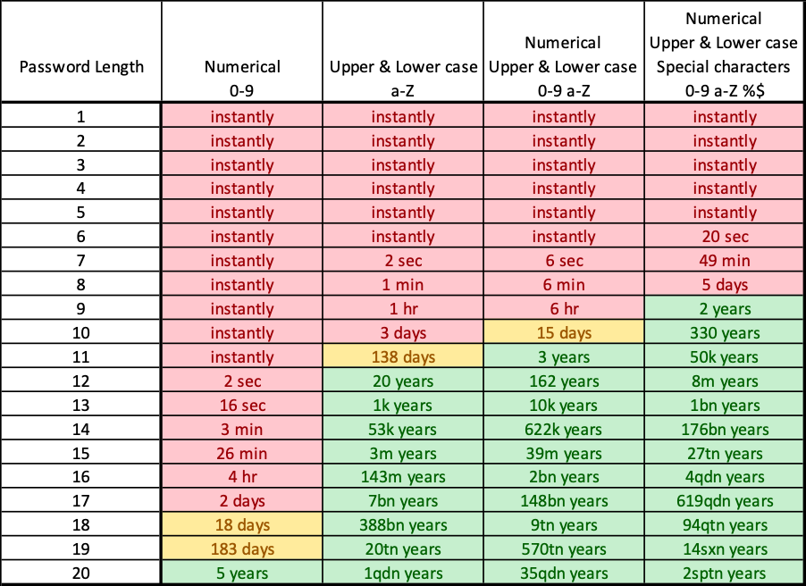

# Дипломная работа
## Организация логинов и паролей, пользователей информационной системы "my_blog"
WSGI-приложение  
(Web Server Gateway Interface - стандарт взаимодействия между python-программой,
выполняющейся на стороне сервера, и самим веб-сервером) 

### План
#### Начальный план:
1) Создание учетной записи:проверка сложности пароля, генератор надежного пароля.
2) Авторизация через сторонние системы, с помощью гугла, гитхаб.
3) Хэширование паролей в БД
4) Защита от SQL-инъекций
5) Проверка паролей на утечки.(сайт have i been pwned)
6) Проверка почты на фишинг
7) Регулярная смена пароля. Блокировка УЗ, если пароль не был сменен во время

#### Текущий план:
Далее план будет расширяться, будет добавлен для каждого пункта процент готовности
* Создаём приложение my_blog
   * окна пользователя
     * авторизация - 100%       
       * авторизация под гостём - 100% 
       * авторизация через google - 100%
       * авторизация через GitHub - 100%
       * ввод email - 100%
       * ввод пароля - 100%
       * переход в Сброс пароля, через почту - 100%        
     * регистрация - 100%       
       * регистрация через google - 100%
       * регистрация через GitHub - 100%
       * проверка email - 100%
         * проверка на правильность формата - 100%
         * проверка на дубль (т.е. не должна уже быть в базе) - 100%
       * проверка пароля - 100% 
         * проверка на длину (например от 2х до ...) символов - 100%
         * проверка наличия типов символов (большая, маленькая, цифры, спец-символы) - 100%
         * проверка на SLQ-инъекции - 0% (не будет, только написать, что при использовании моделей инъекции сделать не получиться)
         * повторный ввод пароля, должен равен первому - 100%
         * кнопка показать/скрыть пароль - 100%
         * генератор пароля - 100% 
         * отображение сложности пароля - 100%
     * профиль пользователя (при нажатии username рядом с аватаркой на панели) - 100%
       * смена email (проверки см. регистрация) - 100% 
       * смена аватарки - 100%
     * Сброс пароля, через почту - 100%
       * проверка email - 100%
         * проверка на правильность формата - 100% 
         * проверка на наличия пользователя с данным email в базе - 100%
     * ввод нового пароля - 100%
       * проверка пароля - 100%
         * проверка на длину (например от 2х до ...) символов - 100%
         * проверка наличия типов символов (большая, маленькая, цифры, спец-символы) - 100%
         * повторный ввод пароля, должен равен первому - 100%
         * кнопка показать/скрыть пароль - 100%
         * генератор пароля - 100%
         * отображение сложности пароля - 100%
   * окна постов - 100%
      * все посты - 100%
      * посты только выбранного пользователя - 100%
      * один пост - 100%
        * если пост владельца, то возможность удалять, править - 100%
      * создание поста - 100%
   * админка - 100%
     * доступ к админке только пользователю с ролью admin - 100%
     * редактирование/создание/удаление в таблицах - 30%
       * User - запретил редактирование/создание, можно редактировать только поле is_active 100%
       * Post - 100%
       * Role - запретил редактирование/создание 100%
       * так и не осилил сделать полноценный редактор User/Role из-за связи многие-ко-многим
     * проверки (только для роли super)
       * проверка email на утечку через выгруженный файл - 100%
       * проверка на утечки паролей через API [Have I Been Pwned API v3](https://haveibeenpwned.com/API/v3#BreachesForAccount) - 100%

#### Проблемы:
* не запускается авторизация, через GitHub
* надо понять как в Облачном хостинге Render добавить секреты от google и github в переменные окружения (GitHub не позволяет их у себя хранить)
* при редактировании и в админке User - возникает ошибка из-за связи один к многим (всё перерыл не получается её побороть)
* на ноуте заблокирован/не работает сайт https://haveibeenpwned.com/API/v3#BreachesForAccount (что создает сложность в проверке на утечки)

### Структура файлов проекта
* migrations - каталог миграции базы (в Git не пушить)
* my_blog - проект блога
  * admin - админка
    * __init__.py - инициализация админки
    * view.py - вьюшки для страниц админки: Утилиты, User, Post, Role
    * utils.py - утилиты администратора (проверка почты и паролей)
  * data - данные
    * app.db - файл с sqlite базой блога
  * errors - макеты ошибок (blueprint)
    * handlers.py - маршруты-обработчики ошибок
  * main - макет по умолчанию (blueprint)
    * routes.py - маршруты
  * posts - макеты постов (blueprint)
    * forms - формы
    * routes.py - маршруты
  * static - статические файлы
    * avatars - аватарки пользователей
    * css - шаблоны стилей
    * images - картинки
  * templates - шаблоны страниц HTML
    * admin - шаблоны админки
    * errors - шаблоны ошибок
    * reset_request.html - отправка запроса на почту на сброс пароля
    * reset_token.html - ввод нового пароля через ссылку из почты
  * users - макеты пользователей (blueprint)
    * forms - формы
    * routes.py - маршруты
    * utils.py - утилиты для работы с пользователями
    * validators - дополнительные классы валидации полей Users
  * __init__.py - инициализация проекта блога (там вся инициализация)
  * configs.py - конфигурационный файл
  * models.py - модели (пользователи, посты)
* runner.py - запуск проекта
* Procfile - файл для развёртывания приложений в облачных хостиногов, таких, как Heroku...
* requirements.txt - список используемых библиотек, используется для их развертывания
* script_migrations.py - скрипт миграции модели в базу данных (см. ниже)

### Используемый стек
* python 3.12 (в облаке python 3.11)
* Flask - микро-фреймворк для веб-разработки (`pip install Flask`)
  * Jinja2 - шаблонизатор
  * WTForms (Flask-WTF) - генератор WT-форм для Flask (`pip install -U Flask-SQLAlchemy`)
  * Flask-SQLAlchemy - работа с Базами Данных (`pip install -U Flask-SQLAlchemy`)
  * Flask-Mail - работа с почтой, основан на smtplib (`pip install Flask-Mail`)
  * Flask-Login - аутентификация (`pip install flask-login`)
  * Flask-Bcrypt - функционал для хеширования и проверки паролей (`pip install flask-bcrypt`)
  * Flask-Bootstrap - CSS фреймворк (`pip install flask-bootstrap`)
  * Flask-Dance - авторизация через OAuth (`pip install flask-dance google-auth-oauthlib`)
  * Flask-Gunicorn - WSGI-сервер для Python-Flask веб-приложений (`pip install gunicorn`)
  * Flask-Admin - административный интерфейс (`pip install Flask-Admin`)
  * Flask-Migrate - обновление полей базы данных (`pip install flask-migrate`)
* SQLite - база данных, основанная на файле. Включен в Flask-SQLAlchemy.
* Pillow - работа с изображениями (`pip install Pillow`)
* ItsDangerous - обеспечение безопасности передачи данных (`pip install itsdangerous`)

### Источники
#### Статьи
[Проектирование простых приложений в Flask (хабр)](https://habr.com/ru/articles/275099/)  
[Мега-Учебник Flask (хабр)](https://habr.com/ru/articles/193242/)  
[Flask. Наполняем «флягу» функционалом (хабр)](https://habr.com/ru/articles/251415/)  
[Начинающему веб-мастеру: делаем одностраничник на Bootstrap (хабр)](https://habr.com/ru/companies/ruvds/articles/350758/)  
[Flask-Admin (хабр)](https://habr.com/ru/articles/148765/)  

#### Документация используемых библиотек
[Flask](https://flask.palletsprojects.com/en/stable/)  
[Jinja2](https://jinja.palletsprojects.com/en/stable/)  
[Flask WTF](https://flask-wtf.readthedocs.io/en/1.2.x/)  
[Flask-SQLAlchemy](https://flask-sqlalchemy.readthedocs.io/en/stable/)  
[Flask-Mail](https://flask-mail.readthedocs.io/en/latest/)  
[Flask-Login](https://flask-login.readthedocs.io/en/latest/)  
[Flask-Bootstrap](https://getbootstrap.com/docs/3.3/getting-started/)  
[Flask-Dance](https://flask-dance.readthedocs.io/en/latest/#)  
[Flask-Gunicorn](https://flask.palletsprojects.com/en/stable/deploying/gunicorn/)  
[Flask-Admin](https://flask-admin.readthedocs.io/en/stable/)  
[Pillow](https://pillow.readthedocs.io/en/stable/)  
[ItsDangerous](https://itsdangerous.palletsprojects.com/en/stable/)  

#### Полезные ссылки
[Дизайнер SQL таблиц](https://sql.toad.cz/?)  
[DB Browser for SQLite - программа просмотра базы SQLite](https://sqlitebrowser.org/dl/)  
[Иконки для кнопок](https://fontawesome.com/v4/icons/)  

#### Облачный хостинг Render
[Render Dashboard](https://dashboard.render.com/web)  
Авторизация через мой GitHab  
amstepannikov/myDiploma используется пока ветка develop  
Ссылка на страницу блога  
https://my-blog-3273.onrender.com  
В бесплатном аккаунте нужно подождать секунд 30 пока блог не проснётся

### Разное
Загрузить библиотеки в requirements.txt (из каталога проекта):  
`pip freeze > requirements.txt`  
Инсталлировать все библиотеки из requirements.txt:  
`pip install -r requirements.txt`  

### Схема данных  
#### users - таблица пользователей  
id - INTEGER, PK, NOT NULL - идентификатор пользователя  
username - VARCHAR(20) NOT NULL - имя  
email - VARCHAR(100), NOT NULL - почта, он же логин  
avatar - VARCHAR(20), NOT NULL - имя-номер файла аватарки, по умолчанию my_blog/static/avatars/default.png
password - VARCHAR(60) - хеш пароля, может быть пустым, если авторизация через внешние ресурсы   
is_active - INTEGER, NOT NULL - 1-активный аккаунт, 0-заблокирован (в SQLite нет типа Boolean)  
date_change_password - DATETIME - время создания/смены пароля  
auth_type - VARCHAR(20), NOT NULL - тип авторизации (my_blog, google, github)

#### role - таблица доступов пользователей
id - INTEGER, PK, NOT NULL - идентификатор роли  
name - VARCHAR(80), NOT NULL - наименование (member, admin, super)  
description - VARCHAR(255), NOT NULL - описание роли

#### roles_users - таблица для связки пользователей и ролей
id - INTEGER, PK, NOT NULL - идентификатор  
user_id - INTEGER, FK, NOT NULL - идентификатор пользователя  
role_id - INTEGER, FK, NOT NULL - идентификатор роли

#### posts - таблица постов
id - INTEGER, PK, NOT NULL - идентификатор поста  
title - VARCHAR(100), NOT NULL - заголовок  
date_posted - DATETIME, NOT NULL - время создания  
content - TEXT, NOT NULL - текст поста  
user_id - INTEGER, FK, NOT NULL - идентификатор пользователя  

### Примерная инструкция к валидации пароля
Извините, Ваш пароль используется более 30 дней, необходимо выбрать новый!
* Розы.
* Извините, слишком мало символов в пароле!
* Розовые розы.
* Извините, пароль должен содержать хотя бы одну цифру!
* 1 розовая роза.
* Извините, не допускается использование пробелов в пароле!
* 1розоваяроза.
* Извините, необходимо использовать как минимум 10 различных символов в пароле!
* 1грёбанаярозоваяроза.
* Извините, необходимо использовать как минимум одну заглавную букву в пароле!
* 1ГРЁБАНАЯрозоваяроза.
* Извините, не допускается использование нескольких заглавных букв, следующих подряд!
* 1ГрёбанаяРозоваяРоза.
* Извините, пароль должен состоять более чем из 20 символов!
* 1ГрёбанаяРозоваяРозаБудетТорчатьУтебяИзЗадаЕслиНеДашьДоступПрямоСейчас!
* Извините, этот пароль уже занят.

### Скорость взлома паролей (2020, сейчас наверное уже быстрее)

### Миграция модели данных
* Важно! Удалить таблицу alembic_version из файла базы данных
* Всё ниже сказанное можно сделать с помощью скрипта script_migrations.py 
* Всё делать в командной строке, находясь в каталоге myDiploma
* Установить переменную среды FLASK_APP 
set FLASK_APP=runner.py  (windows)  
export FLASK_APP=runner.py (linux)  
* Создать репозиторий для миграции (создаст каталог migrations)
flask db init  
* создать миграции
flask db migrate  
* применить миграции
flask db upgrade  

### Регистрация приложения в GitHub (для авторизации через него)
* Перейдите на страницу настроек разработчика GitHub: https://github.com/settings/developers
* Нажмите на кнопку "New OAuth App"
* Локалка
* Application name - my_blog
* Homepage URL - http://localhost:5000
* Application description - Дипломная работа my_blog
* Authorization callback URL - http://localhost:5000/login/github/authorized
* Скопировать Client ID
* Сгенерировать Client secrets и скопировать себе
* Облако Render
* Application name - render_myblog
* Homepage URL - https://my-blog-3273.onrender.com
* Application description - Дипломная работа my_blog
* Authorization callback URL - https://my-blog-3273.onrender.com/login/github/authorized
* Скопировать Client ID
* Сгенерировать Client secrets и скопировать себе

### Регистрация приложения в Google (для авторизации через него)
* Перейдите на страницу Google Console: https://console.developers.google.com/project
* Нажмите на "APIs & auth" в левом меню
* Выберите "Credentials"
* Отдельно нужно создать запись и для локалки и для облака
* Нажмите "+ Create credentials" и выберите "OAuth client ID"
* В Application type выбрать Web application
* Name 
  * для локалки myblog
  * для облака render_myblog
* Authorized JavaScript origins
  * для локалки http://localhost:5000
  * для облака https://my-blog-3273.onrender.com
* Authorized redirect URIs (куда будет возврат после авторизации google)
  * для локалки http://localhost:5000/login/google/authorized
  * для облака https://my-blog-3273.onrender.com/login/google/authorized
* Нажать на кнопку Greate
* Application description - Дипломная работа my_blog
* Скопировать Client ID и Client secrets